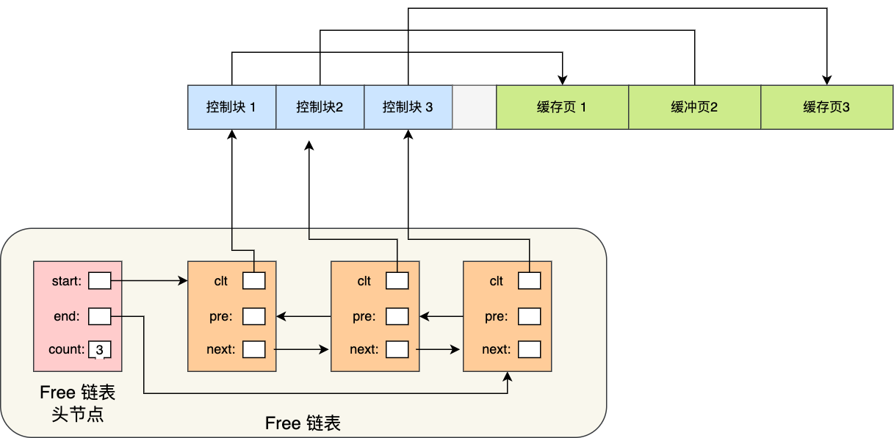
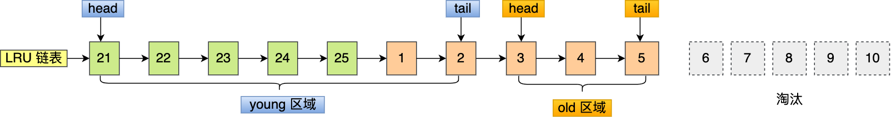
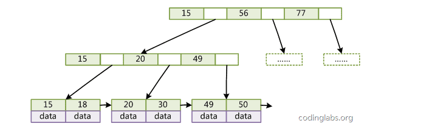
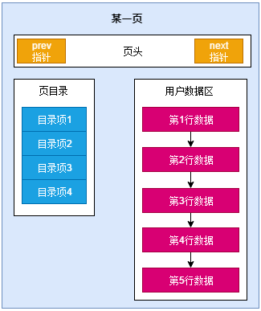
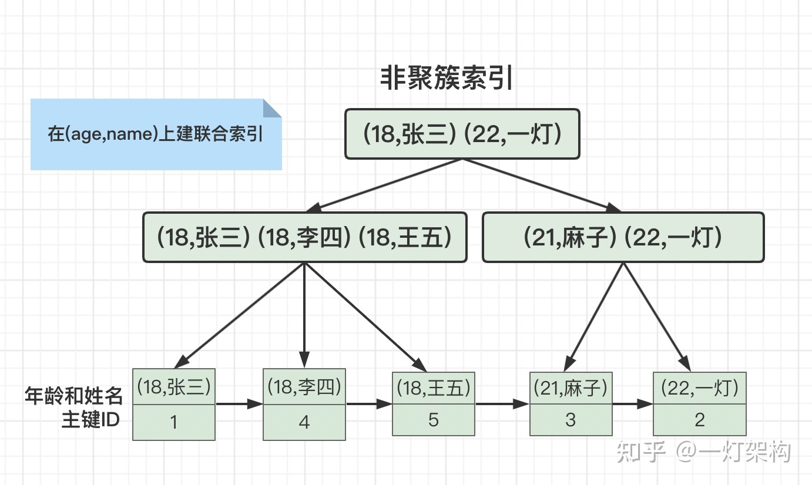

# MySQL <!-- omit in toc -->

> MySQL原本是一个开放源码的关联式资料库管理系统，原开发者为瑞典的MySQL AB公司，该公司于2008年被昇阳微系统（Sun Microsystems）收购。2009年，甲骨文公司（Oracle）收购昇阳微系统公司，MySQL成为Oracle旗下产品。

目录:

- [基础属性](#基础属性)
  - [InnoDB引擎](#innodb引擎)
- [知识点](#知识点)
  - [DoubleWriteBuffer](#doublewritebuffer)
  - [MySQL优化](#mysql优化)
    - [NewSQL](#newsql)
    - [分库分表](#分库分表)
      - [垂直拆分](#垂直拆分)
      - [水平拆分](#水平拆分)
      - [分库分表组件](#分库分表组件)
  - [MySQL日志](#mysql日志)
    - [RedoLog](#redolog)
    - [BinLog](#binlog)
    - [UndoLog](#undolog)
    - [其他问题](#其他问题)
  - [Buffer Pool](#buffer-pool)
    - [Free链表](#free链表)
    - [Flush链表](#flush链表)
    - [LRU链表](#lru链表)
    - [其他问题:](#其他问题-1)
  - [索引](#索引)
    - [索引页(page)](#索引页page)
    - [InnoDB的索引](#innodb的索引)
    - [索引失效](#索引失效)

## 基础属性

### InnoDB引擎

InnoDB引擎的内存及磁盘结构如图所示:

## 知识点

### DoubleWriteBuffer

### MySQL优化

#### NewSQL

选择一些源生支持分布式方案的新数据库

- TiDB;
- PostgreSQL;

#### 分库分表

MySQL官方建议单表数据量应小于500w;

一般来说在实际的使用场景中会采用读写分离+垂直分库+水平分表的形式对应高并发的场景;

##### 垂直拆分

特点:

- 每个库(表)的结构都不相同,专库(表)专用;
- 不同的库(表)间存在相同字段用于关联;
- 全部库(表)的数据并集即为全部数据;

缺点:

- 由于业务特性导致压力会集中在某个库(表)上;
- 由于横跨多个实例将导致无法通过JOIN操作获取数据,提高了开发难度;

##### 水平拆分

##### 分库分表组件

- **proxy层**:通过代理程序完成数据的分库分表操作,对应用层无感知,但性能稍差,如:my-cat,atlas,mysql-proxy,shardingproxy
- **app层**:在应用侧完成数据的分库分表操作,配置时连接多个真实数据库,但性能较好,如:shardingJDBC,TDDL

### MySQL日志

#### RedoLog

RedoLog是InnoDB引擎提供的日志文件,RedoLog日志和事务及BufferPool的脏页回写紧密相关,通俗的讲,该日志用于将用户的更新操作记录下来(RedoLog将直接记录被操作的页编码及对应的数据地址和更新内容)并在合适的时机在磁盘上"重放"已达到更新磁盘数据的目的,同时也作为MySQL启动时重建BufferPool的依据;

默认情况下RedoLog先写入MySQL内存中的LogBuffer部分,在事务提交时自动持久化到磁盘上(由其他后台线程完成根据RedoLog更新磁盘数据的过程),也可以通过配置的方式修改为写入系统缓存或交由其他后台线程定时写入RedoLog文件;

#### BinLog

BinLog是MySQL提供的系统级日志文件,一般用于提供主从同步功能,内部主要记录了用户执行的SQL语句;

#### UndoLog

UndoLog是InnoDB引擎提供的日志文件,一般用于提供事务回滚功能,内部主要记录了用户执行的SQL语句的逆向操作;

#### 其他问题

- BinLog和RedoLog的功能是否有些重复?
  
  BinLog和RedoLog记录的数据是类似的,不过由于BinLog中是保存的SQL,而RedoLog中保存的直接时页编码和数据地址及更新内容,因此RedoLog在进行数据恢复时速度更快,在主从场景下由于受限于RedoLog的48M大小和页编码等数据不一致的原因,因此采用BinLog进行同步;

### Buffer Pool

BufferPool是MySQL的InnoDB引擎用来在内存中保存从磁盘加载的页数据的,默认大小为128m;

一般来说数据页第一次访问时由本地磁盘加载进BufferPool中,后续访问该页将直接从BufferPool中读取;同样的若发生更新也将先更新BufferPool中的数据,再由后台线程定期回写至磁盘;

为了更好的管理BufferPool中的页,MySQL为每个BufferPool中的页设计了一个控制块,其中主要包含了页的表空间、页号、页地址、链表节点等信息;

为了保证BufferPoll的正常更新和淘汰页,有以下3个链表负责维护相关数据:

#### Free链表

主要由头节点(包含空闲列表的头/尾节点位置链表长度等信息)和空闲页的控制块构成的链表;

#### Flush链表

主要由头节点(包含空闲列表的头/尾节点位置链表长度等信息)和空闲页的控制块构成的链表,其结构与Flush链表几乎一致,只不过该链表用来维护脏页(即发生过数据更新的页);

#### LRU链表

引入LRU链表的主要作用在于建立正常的页淘汰机制,帮助提高BufferPool的缓存命中率;

简单的LRU链表工作方式如下:

1. 头节点时当前的热点数据,末尾节点为冷数据;
2. 新访问数据时将添加至头节点,若空间不足则从末尾节点淘汰后插入头节点;

但是使用纯粹的LRU算法将带来两个问题:

- **预读失效**:MySQL在从磁盘加载页时会同时加载相邻的页到BufferPoll,这导致了存在相邻的非热点数据占据了LRU链表的头部节点进而挤占了热点数据的空间;
- **全表扫描污染**:意外产生的全表扫描将导致加载全部页到BufferPoll,因此淘汰了之前的全部热点数据;

因此MySQL在LRU算法的基础上做出以下优化帮助解决上述问题;

- 冷热数据分区:链表前部为热数据区,后部分为冷数据区,默认比例8:2,预读的数据加入冷数据区,真实使用的页进入热数据区;
- 冷热数据的晋升机制:处于冷数据区的页只有被间隔1s以上的时间访问2次才会被升入热数据区(防止出现由于全表逐行扫描导致的误判热数据),为了防止热数据区的页频繁的移动至头部,位于热数据区前1/4的节点不会被移动;

完整的MySQL中LRU链表如图:

#### 其他问题:

- BufferPool是否支持并发?
  
  默认配置下MySQL是通过串行的方式限制了并发访问BufferPool的数据的;但是MySQL支持通过配置的方式生成多个BufferPool实例,当数据页加载时将基于**数据页缓存哈希表**防止出现一个数据页被多个BufferPool重复加载的场景,该方式可用于提高并发性能;

- 动态调整BufferPool的Size
  
  MySQL管理BufferPool是通过一个个chunk来实现,因此扩容时仅需要申请全新的chunk空间,并将其纳入链表的管理范围即可;

### 索引

索引的本质是一种被排过序的数据结构,类似于书籍的目录.依赖索引文件的少量I/O操作去获得真实完整数据的工具;

MySQL在早期尝试过多种索引的数据结构,如:二叉树/红黑树等,最终稳定在B+树和hash上;

**各种数据结构存储索引的优缺点:**

| 数据结构 | 说明                                                                                    |
| :------: | :-------------------------------------------------------------------------------------- |
|  二叉树  | 由于不支持自平衡,因此容易产生偏斜的树导致查询效率降低                                   |
|  红黑树  | 在二叉树的特性基础上支持自平衡,但容易产生树高较高的树,导致查询效率降低                  |
|   B树    | 在红黑树特性的基础上限制树高(通过每个树节点可以横向保存多个数据实现按顺序递增)          |
|   B+树   | 在B树的基础上添加一些其他特性如:仅在叶子节点保存数据;增加叶子节点间的指针优化范围查询等 |
|   hash   | 比B+树效率更高,但不支持范围查询且存在hash冲突的风险                                     |

**B+树**

#### 索引页(page)

索引页既是B树的叶子节点的内容;

主要由以下部分构成:

- 目录页:用于保存分组的用户记录起始位置;
- 用户记录:保存行数据
- 通用页结构:描绘该页的一些基础信息;

#### InnoDB的索引

1. InnoDB引擎的表最好必须设置主键且使用整型自增效果更佳(乱序插入将导致一些额外的B树平衡操作);
2. InnoDB引擎的表**有且仅有一个**聚簇索引树(有主键依赖主键建立,若无主键依赖行号建立);
3. InnoDB引擎的表中建立非主键索引是通过非聚簇索引树实现的,叶子节点保存了该数据的主键信息(通过主键再次查询主键树获取数据即**回表**操作);
4. 联合索引的所有索引列都出现在索引树上,并依次比较三列的大小,即只有在3个字段依次比较的情况下树节点才是有顺序的,这就是最左匹配原则的由来;
   
5. 查询条件中的大于/小于条件也是可以走索引的,实现原理为先查询等于的情况定位到指定元素后再利用B+树叶子节点已排序的特点查询其他元素
6. MySQL会自动优化使用的索引,若发生频繁的回表等耗时操作可能会忽略索引;
7. 5.7之前的版本建立的都是升序索引即使显示的使用desc建立索引,MySQL8之后支持建立降序索引;

#### 索引失效

1. 联合索引不满足最左匹配原则;
2. MySQL的自动优化认为全表扫描更快(如产生多次回表操作);
3. 查询条件的索引字段上包含公式/函数/隐式类型转换;